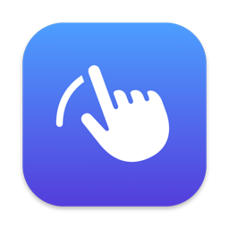

<p align="center"></p>

<h1 align="center">SwipeSwitcher</h1>

<p align="center">Switch apps on macOS with a four-finger trackpad swipe, with a ⌘-Tab style preview.</p>

---

Put four fingers on the trackpad and slide sideways: a preview of the apps on your current
desktop appears, each further slide moves the selection, and lifting your fingers switches.
It works like holding ⌘ and pressing Tab, but on the trackpad.

## Features

- **4-finger (or 3-finger) horizontal swipe** with a live preview; lift to switch
- **Most-recently-used order**, like ⌘-Tab: one slide right goes to the app you used last
- **Current desktop only**: apps that live on another Space, are minimized, or have no open
  window are left out
- **Resolves gesture conflicts for you**: if macOS already uses the same swipe to switch
  desktops, SwipeSwitcher offers to move desktop switching to the other finger count
- **Optional scroll blocking** while the gesture is in progress (needs Accessibility)
- Adjustable distance per step (10 / 15 / 25 % of the trackpad width) and steps per gesture
- Launch at login
- Menu bar only, no Dock icon

## Requirements

- macOS 15 Sequoia or later, Apple silicon or Intel
- A built-in trackpad or a Magic Trackpad

## Install

1. Download `SwipeSwitcher-<version>.dmg` from the
   [latest release](https://github.com/haonlabs/SwipeSwitcher/releases/latest) and open it
   (a `.zip` is available too).
2. Drag **SwipeSwitcher** onto the **Applications** shortcut, then open it from Applications.
3. The app is not notarized, so macOS blocks the first launch. Open
   **System Settings → Privacy & Security**, scroll down to **Security**, click
   **Open Anyway** next to SwipeSwitcher, and confirm. You only need to do this once per version.

## Setup

- **Gesture conflict.** On launch, SwipeSwitcher checks whether macOS already uses a
  horizontal swipe with the same number of fingers (usually *Swipe between full-screen
  applications*). If it does, a dialog offers to fix it: macOS stops using that swipe, and
  desktop switching moves to the other finger count if that one is free. You can change it
  back anytime in **System Settings → Trackpad → More Gestures**.
- **Scroll blocking (optional).** Moving several fingers also makes the app under the pointer
  scroll. To stop that, choose **Block Scrolling During Gesture** from the menu bar icon and allow
  SwipeSwitcher under **Privacy & Security → Accessibility**. Without this permission, everything
  else still works.
- **3-finger mode.** If you choose 3 fingers, turn off **Three-finger drag** under
  **Accessibility → Pointer Control → Trackpad Options**.

## Usage

| Gesture | Result |
|---|---|
| Four fingers, slide right | Preview opens and selects the previous app |
| Keep sliding right / left | Selection moves one app per step |
| Lift fingers | Switch to the selected app |
| Slide back to the first icon, then lift | Cancel (stay in the current app) |

The menu bar icon (✋) has the settings: finger count, step distance, steps per gesture,
scroll blocking, and launch at login.

## Build from source

Requires Xcode 16 or later.

```sh
git clone https://github.com/haonlabs/SwipeSwitcher.git
cd SwipeSwitcher
./build.sh            # builds a universal SwipeSwitcher.app
open SwipeSwitcher.app
swift test            # gesture and MRU logic tests
```

`build.sh` signs with the first code-signing certificate in your keychain (or `SIGN_IDENTITY`),
falling back to ad-hoc. With ad-hoc signing, macOS forgets the Accessibility permission on every
rebuild, so create a certificate once: **Keychain Access → Certificate Assistant → Create a
Certificate**, Identity Type *Self Signed Root*, Certificate Type *Code Signing*.

`scripts/make-dmg.sh` packs the built app into a drag-to-install DMG.
`swift scripts/render-icon.swift` regenerates `AppIcon.icns`, and `./bench.sh SwipeSwitcher 60`
samples CPU, idle wakeups, and energy impact, so you can compare against other tools.

## How it works

macOS has no public API that reports how many fingers are on the trackpad. SwipeSwitcher
reads raw touch data from Apple's private `MultitouchSupport` framework, the same approach used
by most tools of this kind.

The touch callback runs roughly 100 times per second whenever any finger touches the trackpad,
so it is kept cheap:

- Ordinary one- and two-finger use exits after a single integer comparison. It takes no lock,
  allocates nothing, and never wakes the main thread.
- The main thread is woken only when a step fires or the fingers lift.
- There are no timers or polling. App activation and quit notifications keep the MRU list up
  to date.
- The scroll-blocking event tap is disabled except while the gesture fingers are down, so your
  normal scrolling never passes through the app.
- Touch devices are stopped during sleep and restarted on wake.

Switching apps uses `NSRunningApplication.activate()` and needs no permission.

## Privacy

SwipeSwitcher runs entirely on your Mac. It makes no network requests, collects no analytics,
and reads no window contents, only which apps own windows on screen. Settings are stored in
macOS `UserDefaults`.

## Limitations

- It relies on a private framework, so a future macOS update may break it. It cannot be
  distributed through the Mac App Store.
- A Magic Trackpad connected while the app is running is picked up after the next sleep/wake
  or relaunch.
- Releases are signed with a self-signed certificate, not notarized, so the first launch of
  each version needs **Open Anyway**. Because the certificate stays the same, the Accessibility
  permission carries over to new versions.

## License

[MIT](LICENSE)
